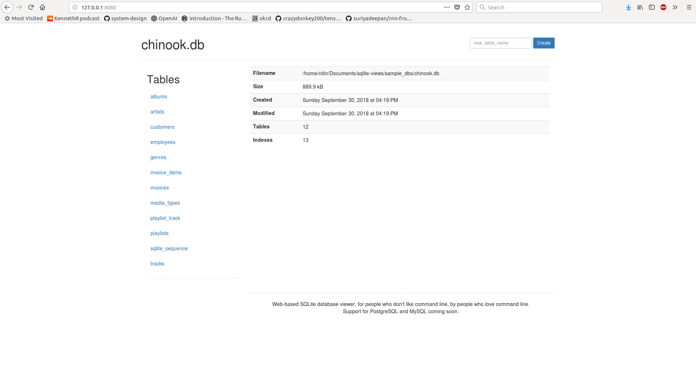
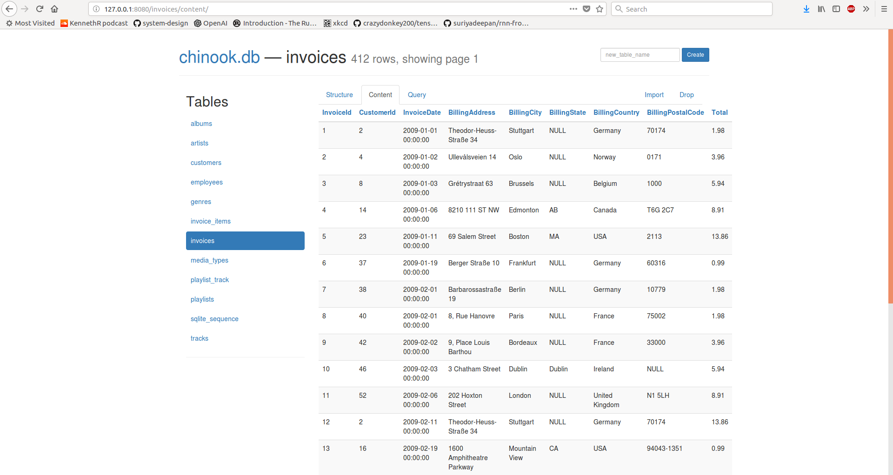
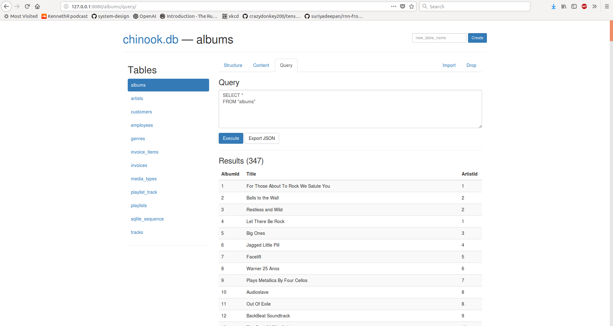

# sqlite-db-viewer
For folks who hate terminal by folks who love terminal!

`sqlite-db-viewer` is a web-based SQLite database manager that provides an interactive and a nice interface to manage your SQLite databases.

## Project dependencies
- Flask
- peewee

## Features
- Works only with existing database(empty/non-empty) file.
- Add or discard
    - Tables
    - Columns
    - Indexes
- Import/Export data as JSON
- Most importantly, a nice interface to know your database!

## Proof you ask!

- `Index`. The place where it all starts. The index page shows some basic information about the database, including the number of tables and indexes, as well as its size on disk with the storage location.


- Table Structure. This page discplayes the table along with all the other options available such as adding and dropping a column as well as importing the data.


- Table content. This feature allows you to see the content of the table.


- `Query`. You can also execute SQL queries on the go!!


## Building

This project is backed by `pipenv` which is the recommended package management tool by `python.org`.

To install pipenv:
```
pip install pipenv
```

Let's build the project now:

```bash
# clone and navigate the repo
git clone https://github.com/nitinprakash96/sqlite-db-viewer.git
cd sqlite-db-viewer

# activate virtualenv and install dependencies
pipenv shell
pipenv install

# Run the project
python views.py sample_dbs/chinhook.db
```